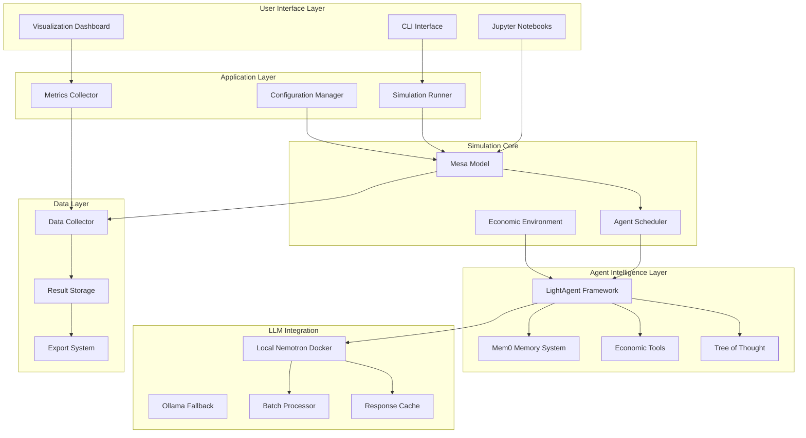

# Design Document

## Overview

The EconAgent-Light system modernizes the original ACL24-EconAgent research by replacing the existing ai-economist foundation framework with Mesa for agent-based modeling, integrating LightAgent framework (v0.4.0+) for intelligent agent capabilities, and using local LLM services (NVIDIA Nemotron Docker + Ollama fallback) instead of paid OpenAI APIs. 

The original system uses a custom foundation framework with components like SimpleLabor, PeriodicBracketTax, SimpleConsumption, and SimpleSaving within a OneStepEconomy scenario. Our system will preserve the economic logic and equations from the original paper while migrating to Mesa's more standard ABM framework and adding enterprise-level improvements in performance, reliability, and maintainability.

Key improvements over the original:
- Replace paid OpenAI API calls with free local LLM services
- Migrate from custom ai-economist foundation to standard Mesa framework
- Integrate LightAgent for enhanced memory, tools, and reasoning capabilities
- Add comprehensive testing, caching, and batch processing
- Maintain compatibility with original economic equations and parameters

## Architecture

### High-Level Architecture



### Component Architecture

#### 1. Mesa Model Layer
- **EconModel**: Central simulation model extending Mesa.Model
- **Agent Scheduler**: RandomActivationByType for coordinated agent execution
- **Environment Components**: Government, Bank, Goods Market entities
- **Data Collection**: Automated metrics gathering and economic indicator tracking

#### 2. LightAgent Integration Layer
- **Agent Wrapper**: Integration between Mesa agents and LightAgent framework
- **Memory Management**: Mem0-based persistent memory for each economic agent
- **Tool System**: Economic decision-making tools and market analysis utilities
- **Tree of Thought**: Complex reasoning for economic decision-making

#### 3. LLM Processing Layer
- **Nemotron Client**: HTTP client for NVIDIA Nemotron API communication
- **Batch Processing**: Concurrent request handling for multiple agents
- **Response Caching**: In-memory caching for identical prompts
- **Validation System**: JSON schema validation and value clamping

## Components and Interfaces

### Core Components

#### EconModel (Mesa Model)
```python
class EconModel(mesa.Model):
    """
    Mesa-based economic simulation model replacing ai-economist foundation.
    Preserves original economic logic while using Mesa's standard ABM framework.
    """
    def __init__(self, N=100, episode_length=240, **original_config):
        # Migrate original config.yaml parameters to Mesa
        # Initialize Mesa scheduler (RandomActivationByType)
        # Create economic agents with LightAgent integration
        # Setup economic environment (price, wages, taxes, interest)
        # Initialize DataCollector for metrics tracking
        
        # Original parameters from config.yaml
        self.productivity = 1.0
        self.skill_change = 0.02
        self.price_change = 0.02
        self.max_price_inflation = 0.1
        self.max_wage_inflation = 0.05
        
    def step(self):
        # Replicate original simulate.py step logic in Mesa
        # 1. Agent decision-making (work/consumption via LightAgent)
        # 2. Economic calculations (production, consumption, wages, prices)
        # 3. Tax collection and redistribution
        # 4. Interest rate updates (Taylor rule)
        # 5. Quarterly reflections (every 3 months)
        # 6. Data collection and logging
```

#### EconAgent (Mesa Agent + LightAgent)
```python
class EconAgent(mesa.Agent):
    """
    Mesa agent replacing ai-economist BasicMobileAgent with LightAgent integration.
    Preserves original agent attributes and economic behavior.
    """
    def __init__(self, unique_id, model, light_agent_wrapper):
        super().__init__(unique_id, model)
        
        # Original agent attributes from ai-economist
        self.skill = self.model.random.paretovariate(8)  # From original pareto_param
        self.inventory = {'Coin': 0}  # Wealth/savings
        self.income = {'Coin': 0}
        self.consumption = {'Coin': 0}
        
        # Original endogenous attributes
        self.endogenous = {
            'name': f"Agent_{unique_id}",
            'age': self.model.random.randint(18, 65),
            'city': self.model.random.choice(['NYC', 'LA', 'Chicago']),
            'job': 'Unemployment',
            'offer': self.model.random.choice(['Engineer', 'Teacher', 'Doctor'])
        }
        
        # LightAgent integration
        self.light_agent = light_agent_wrapper
        
    def step(self):
        # Replicate original gpt_actions logic with LightAgent
        # Build economic context (replaces original problem_prompt)
        # Call LightAgent for work/consumption decisions
        # Apply decisions with original economic calculations
        # Update financial state using original formulas
    
    def reflect(self):
        # Quarterly reflection using LightAgent (replaces original reflection_prompt)
        # Store insights in LightAgent memory system
```

#### LightAgentWrapper
```python
class LightAgentWrapper:
    """
    Integration layer between Mesa agents and LightAgent framework.
    """
    def __init__(self, nemotron_client, memory_config, tools):
        # LightAgent initialization
        # Memory system setup (mem0)
        # Tool registration
        # ToT configuration
    
    def decide(self, agent_profile, env_snapshot):
        # Build perception prompt
        # Execute Tree of Thought reasoning
        # Call Nemotron for decision
        # Validate and return results
    
    def reflect(self, agent_profile, quarterly_data):
        # Generate reflection prompt
        # Process learning insights
        # Update memory patterns
```

#### NemotronClient
```python
class NemotronClient:
    """
    HTTP client for local NVIDIA Nemotron Docker container communication.
    """
    def __init__(self, base_url="http://localhost:8000/v1", fallback_url="http://localhost:11434/v1"):
        # Local Docker container configuration
        # Ollama fallback configuration
        # Request session setup
        # Retry mechanism configuration
    
    def call_model(self, messages, stream=False):
        # Format OpenAI-compatible request
        # Try local Nemotron Docker first
        # Fallback to Ollama if Nemotron unavailable
        # Process response and validation
        # Error handling and local fallbacks
    
    def batch_call(self, message_batches):
        # Concurrent request processing
        # Response aggregation
        # Error handling for batch failures
```

### Interface Specifications

#### Agent Decision Interface
```python
@dataclass
class AgentProfile:
    name: str
    age: int
    job: str
    monthly_wage: float
    savings: float
    last_work: bool
    last_consumption: float

@dataclass
class EnvironmentSnapshot:
    year: int
    month: int
    price: float
    interest_rate: float
    unemployment_rate: float
    inflation_rate: float
    tax_brackets: List[TaxBracket]

@dataclass
class AgentDecision:
    work_propensity: float  # [0,1] in 0.02 steps
    consumption_propensity: float  # [0,1] in 0.02 steps
    confidence: float
    reasoning: str
```

#### Memory Interface
```python
class EconomicMemory:
    """
    Mem0-based memory system for economic agents.
    """
    def store_interaction(self, user_id: str, interaction: dict):
        # Store agent interaction in mem0
    
    def retrieve_relevant(self, user_id: str, query: str) -> List[dict]:
        # Retrieve relevant memories for decision-making
    
    def store_reflection(self, user_id: str, reflection: dict):
        # Store quarterly reflection insights
    
    def get_learning_patterns(self, user_id: str) -> dict:
        # Extract learned behavioral patterns
```

## Data Models

### Agent State Model
```python
@dataclass
class AgentState:
    # Identity
    agent_id: str
    name: str
    age: int
    job: str
    location: str
    
    # Financial State
    savings: float
    monthly_wage: float
    last_income: float
    tax_paid: float
    redistribution_received: float
    
    # Behavioral State
    last_work_decision: bool
    last_consumption_decision: float
    work_history: List[bool]
    consumption_history: List[float]
    
    # Memory and Learning
    memory_store: EconomicMemory
    learning_patterns: dict
    reflection_history: List[dict]
```

### Economic Environment Model
```python
@dataclass
class EconomicEnvironment:
    # Market State
    goods_inventory: float
    goods_price: float
    average_wage: float
    
    # Monetary Policy
    interest_rate: float
    inflation_target: float
    unemployment_target: float
    
    # Fiscal Policy
    tax_brackets: List[TaxBracket]
    government_spending: float
    redistribution_pool: float
    
    # Economic Indicators
    gdp: float
    unemployment_rate: float
    inflation_rate: float
    productivity: float
```

### Simulation Configuration Model
```python
@dataclass
class SimulationConfig:
    # Simulation Parameters
    num_agents: int = 100
    num_years: int = 20
    steps_per_year: int = 12
    random_seed: int = 42
    
    # Economic Parameters
    productivity: float = 1.0
    alpha_wage: float = 0.05
    alpha_price: float = 0.10
    natural_rate: float = 0.01
    inflation_target: float = 0.02
    unemployment_target: float = 0.04
    
    # LLM Parameters
    batch_size: int = 8
    use_tree_of_thought: bool = True
    memory_window: int = 1
    reflection_frequency: int = 3  # months
    
    # Performance Parameters
    enable_caching: bool = True
    parallel_threads: int = 8
    enable_streaming: bool = False
```

## Error Handling

### LLM Response Validation
```python
class ResponseValidator:
    """
    Validates and sanitizes LLM responses for economic decisions.
    """
    @staticmethod
    def validate_decision(response: dict) -> AgentDecision:
        # JSON schema validation
        # Value range clamping [0,1]
        # Step size validation (0.02 increments)
        # Fallback value assignment
    
    @staticmethod
    def normalize_value(value: float) -> float:
        # Clamp to [0,1] range
        # Round to 0.02 step increments
        return round(max(0.0, min(1.0, value)) * 50) / 50.0
```

### Fallback Mechanisms
1. **LLM Failure Fallback**: Default conservative decisions (work=0.2, consumption=0.1)
2. **Network Error Handling**: Exponential backoff retry with circuit breaker
3. **Memory System Fallback**: Local storage when mem0 unavailable
4. **Batch Processing Fallback**: Sequential processing when concurrent fails

## Testing Strategy

### Unit Testing
- **Component Tests**: Individual component functionality validation
- **Integration Tests**: Interface compatibility and data flow validation
- **Mock Testing**: LLM response simulation for offline testing
- **Performance Tests**: Benchmarking and resource usage validation

### Test Coverage Areas
1. **Nemotron Client**: API communication, response parsing, error handling
2. **LightAgent Wrapper**: Decision-making logic, memory integration, tool usage
3. **Mesa Model**: Simulation step execution, data collection, economic calculations
4. **Economic Environment**: Tax calculations, market dynamics, policy updates
5. **Validation Systems**: Response validation, value clamping, schema compliance

### Integration Testing
```python
class IntegrationTestSuite:
    """
    End-to-end integration testing for the complete system.
    """
    def test_full_simulation_cycle(self):
        # Initialize system with test configuration
        # Run short simulation (N=10, steps=12)
        # Validate economic indicators within expected ranges
        # Verify agent decision consistency
    
    def test_memory_persistence(self):
        # Test agent memory across multiple steps
        # Validate reflection mechanism
        # Verify learning pattern evolution
    
    def test_batch_processing(self):
        # Test concurrent agent processing
        # Validate response aggregation
        # Verify error handling in batch scenarios
```

## Performance Considerations

### Optimization Strategies
1. **Batch Processing**: Group agent decisions for concurrent LLM calls
2. **Response Caching**: Cache identical prompts to reduce API calls
3. **Memory Management**: Efficient mem0 usage with configurable retention
4. **Parallel Processing**: Concurrent agent execution with thread pool management

### Scalability Design
- **Horizontal Scaling**: Support for distributed agent processing
- **Memory Optimization**: Configurable memory windows and cleanup policies
- **API Rate Limiting**: Intelligent request throttling and queue management
- **Resource Monitoring**: Real-time performance metrics and bottleneck detection

### Performance Metrics
- **Simulation Speed**: Steps per second, agent decisions per minute
- **Memory Usage**: Agent memory footprint, system memory consumption
- **API Efficiency**: Request success rate, average response time, cache hit ratio
- **Economic Accuracy**: Deviation from expected economic indicators

This design provides a robust foundation for implementing the EconAgent-Light system with enterprise-level reliability, performance, and maintainability while preserving the scientific rigor of the original research.