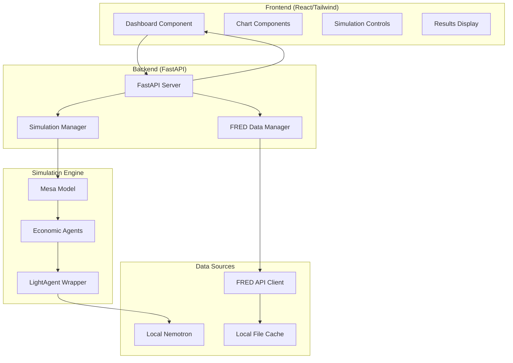

# Design Document

## Overview

The EconAgent-Light system is a local MVP that integrates real-time Federal Reserve Economic Data (FRED) with intelligent agent-based modeling using a professional React/Tailwind frontend. The system combines Mesa for ABM simulation, LightAgent framework for intelligent agents, local Nemotron LLM, and FRED data integration to create a powerful economic research tool that runs entirely on your local machine.

The system transforms the original ACL24-EconAgent research into a modern, data-driven application that:
- Calibrates simulations using real-time FRED economic data
- Provides a beautiful, professional web interface for simulation control and visualization
- Validates simulation results against actual economic indicators
- Runs entirely locally with no deployment complexity

Key features for the MVP:
- **Real-time FRED Integration**: Live economic data fetching and calibration
- **Professional React/Tailwind UI**: Clean, modern dashboard with interactive charts
- **Local Nemotron LLM**: Intelligent agents powered by local Nemotron
- **LightAgent Framework**: Enhanced agent capabilities with memory and reasoning
- **Mesa Simulation**: Robust agent-based economic modeling
- **Local Development**: Simple setup and execution on local machine

## Architecture

### High-Level Architecture (Local MVP)



### Component Architecture (Simplified for MVP)

#### 1. React Frontend (Professional UI)
- **Dashboard**: Clean, modern layout with Tailwind CSS styling
- **Simulation Controls**: Parameter configuration with real-time validation
- **Economic Charts**: Interactive visualizations using Chart.js for economic indicators
- **FRED Data Display**: Real-time economic data from Federal Reserve
- **Results Export**: Download simulation results as CSV/Excel

#### 2. FastAPI Backend (Minimal but Clean)
- **Simulation API**: Simple REST endpoints for starting/monitoring simulations
- **FRED Integration**: Endpoints for fetching and caching economic data
- **File Management**: Handle simulation exports and data files
- **CORS Setup**: Enable frontend-backend communication

#### 3. FRED Data Integration
- **FRED Client**: Fetch real economic data (unemployment, inflation, GDP, etc.)
- **Local Caching**: Simple file-based caching to avoid API rate limits
- **Data Calibration**: Adjust simulation parameters based on current economic conditions

#### 4. Simulation Engine
- **Mesa Model**: Economic simulation with FRED-calibrated parameters
- **LightAgent Agents**: Intelligent economic agents with Nemotron integration
- **Local Nemotron**: Use local Nemotron for agent decision-making
- **Memory System**: Simple agent memory for learning and adaptation

#### 5. Local Storage
- **File System**: Store simulation results, FRED cache, and exports locally
- **No Database**: Keep it simple with JSON/CSV files for the MVP

## Components and Interfaces (MVP Focus)

### Core Components

#### Simple FastAPI Backend
```python
from fastapi import FastAPI, BackgroundTasks
from fastapi.middleware.cors import CORSMiddleware
from fastapi.staticfiles import StaticFiles
import uvicorn

app = FastAPI(title="EconAgent-Light MVP")

# Enable CORS for React frontend
app.add_middleware(
    CORSMiddleware,
    allow_origins=["http://localhost:3000"],  # React dev server
    allow_methods=["*"],
    allow_headers=["*"],
)

# Serve React build files
app.mount("/static", StaticFiles(directory="frontend/build/static"), name="static")

@app.post("/api/simulations/start")
async def start_simulation(
    config: SimulationConfig, 
    background_tasks: BackgroundTasks
):
    """Start a new simulation with FRED calibration."""
    # Fetch current FRED data
    fred_data = await fred_manager.get_current_snapshot()
    
    # Calibrate simulation parameters
    calibrated_config = calibrate_with_fred_data(config, fred_data)
    
    # Start simulation in background
    background_tasks.add_task(run_simulation, calibrated_config)
    
    return {"status": "started", "config": calibrated_config}

@app.get("/api/fred/current")
async def get_current_fred_data():
    """Get current economic indicators from FRED."""
    return await fred_manager.get_current_snapshot()

@app.get("/api/simulations/results")
async def get_simulation_results():
    """Get latest simulation results."""
    return load_latest_results()

if __name__ == "__main__":
    uvicorn.run(app, host="0.0.0.0", port=8000)
```

#### Professional React Dashboard
```typescript
import React, { useState, useEffect } from 'react';
import { Line } from 'react-chartjs-2';

const Dashboard: React.FC = () => {
  const [simulationConfig, setSimulationConfig] = useState({
    numAgents: 100,
    numYears: 20,
    useFredCalibration: true
  });
  const [simulationStatus, setSimulationStatus] = useState('idle');
  const [fredData, setFredData] = useState(null);
  const [results, setResults] = useState(null);

  // Fetch current FRED data on load
  useEffect(() => {
    fetch('http://localhost:8000/api/fred/current')
      .then(res => res.json())
      .then(setFredData);
  }, []);

  const startSimulation = async () => {
    setSimulationStatus('running');
    
    const response = await fetch('http://localhost:8000/api/simulations/start', {
      method: 'POST',
      headers: { 'Content-Type': 'application/json' },
      body: JSON.stringify(simulationConfig)
    });
    
    // Poll for results
    const pollResults = setInterval(async () => {
      const resultsResponse = await fetch('http://localhost:8000/api/simulations/results');
      const data = await resultsResponse.json();
      
      if (data.status === 'completed') {
        setResults(data);
        setSimulationStatus('completed');
        clearInterval(pollResults);
      }
    }, 2000);
  };

  return (
    <div className="min-h-screen bg-gradient-to-br from-blue-50 to-indigo-100">
      {/* Header */}
      <header className="bg-white shadow-sm border-b">
        <div className="max-w-7xl mx-auto px-4 sm:px-6 lg:px-8">
          <div className="flex justify-between items-center py-6">
            <h1 className="text-3xl font-bold text-gray-900">
              EconAgent-Light Dashboard
            </h1>
            <div className="flex items-center space-x-4">
              <span className="text-sm text-gray-500">
                Status: <span className="font-medium">{simulationStatus}</span>
              </span>
            </div>
          </div>
        </div>
      </header>

      <div className="max-w-7xl mx-auto px-4 sm:px-6 lg:px-8 py-8">
        <div className="grid grid-cols-1 lg:grid-cols-4 gap-8">
          
          {/* Simulation Controls */}
          <div className="lg:col-span-1">
            <SimulationControls 
              config={simulationConfig}
              onChange={setSimulationConfig}
              onStart={startSimulation}
              disabled={simulationStatus === 'running'}
            />
          </div>

          {/* Main Charts Area */}
          <div className="lg:col-span-2">
            <EconomicCharts results={results} />
          </div>

          {/* FRED Data Panel */}
          <div className="lg:col-span-1">
            <FREDDataPanel data={fredData} />
          </div>
        </div>
      </div>
    </div>
  );
};

// Clean, professional components with Tailwind
const SimulationControls: React.FC = ({ config, onChange, onStart, disabled }) => (
  <div className="bg-white rounded-lg shadow-md p-6">
    <h2 className="text-lg font-semibold text-gray-900 mb-4">
      Simulation Configuration
    </h2>
    
    <div className="space-y-4">
      <div>
        <label className="block text-sm font-medium text-gray-700 mb-1">
          Number of Agents
        </label>
        <input
          type="number"
          value={config.numAgents}
          onChange={(e) => onChange({...config, numAgents: parseInt(e.target.value)})}
          className="w-full px-3 py-2 border border-gray-300 rounded-md focus:outline-none focus:ring-2 focus:ring-blue-500"
        />
      </div>
      
      <div>
        <label className="block text-sm font-medium text-gray-700 mb-1">
          Simulation Years
        </label>
        <input
          type="number"
          value={config.numYears}
          onChange={(e) => onChange({...config, numYears: parseInt(e.target.value)})}
          className="w-full px-3 py-2 border border-gray-300 rounded-md focus:outline-none focus:ring-2 focus:ring-blue-500"
        />
      </div>
      
      <div className="flex items-center">
        <input
          type="checkbox"
          checked={config.useFredCalibration}
          onChange={(e) => onChange({...config, useFredCalibration: e.target.checked})}
          className="h-4 w-4 text-blue-600 focus:ring-blue-500 border-gray-300 rounded"
        />
        <label className="ml-2 block text-sm text-gray-700">
          Use FRED Calibration
        </label>
      </div>
      
      <button
        onClick={onStart}
        disabled={disabled}
        className="w-full bg-blue-600 text-white py-2 px-4 rounded-md hover:bg-blue-700 disabled:opacity-50 disabled:cursor-not-allowed transition-colors"
      >
        {disabled ? 'Running...' : 'Start Simulation'}
      </button>
    </div>
  </div>
);
```

#### FRED Data Integration
```python
class FREDDataManager:
    """
    Manages FRED data fetching, caching, and calibration.
    """
    def __init__(self, fred_client: FREDClient, cache: Redis):
        self.fred_client = fred_client
        self.cache = cache
        self.calibration_engine = CalibrationEngine()
        
    async def get_current_economic_snapshot(self) -> EconomicSnapshot:
        # Fetch latest FRED data for key indicators
        # Cache results with appropriate TTL
        # Return structured economic snapshot
        
    async def calibrate_simulation_parameters(
        self, 
        base_config: SimulationConfig
    ) -> SimulationConfig:
        # Fetch historical FRED data
        # Analyze trends and patterns
        # Adjust simulation parameters accordingly
        # Return calibrated configuration
        
    async def validate_simulation_results(
        self,
        simulation_results: SimulationResults,
        fred_comparison_period: str
    ) -> ValidationReport:
        # Compare simulation outputs with FRED data
        # Calculate statistical significance
        # Generate validation report
```

#### Enhanced EconModel with FRED Integration
```python
class EconModel(mesa.Model):
    """
    Mesa-based economic simulation with FRED data integration.
    """
    def __init__(
        self, 
        config: SimulationConfig,
        fred_manager: FREDDataManager,
        websocket_manager: WebSocketManager
    ):
        super().__init__()
        self.config = config
        self.fred_manager = fred_manager
        self.websocket_manager = websocket_manager
        
        # Initialize with FRED-calibrated parameters
        self.initialize_from_fred_data()
        
        # Setup Mesa components
        self.schedule = RandomActivationByType(self)
        self.datacollector = DataCollector(model_reporters=self.get_model_reporters())
        
        # Create agents with FRED-aware LightAgent integration
        self.create_agents()
        
    async def initialize_from_fred_data(self):
        # Get current economic snapshot from FRED
        snapshot = await self.fred_manager.get_current_economic_snapshot()
        
        # Set initial economic conditions
        self.unemployment_rate = snapshot.unemployment_rate
        self.inflation_rate = snapshot.inflation_rate
        self.interest_rate = snapshot.fed_funds_rate
        self.gdp_growth = snapshot.gdp_growth
        
    def step(self):
        # Execute simulation step with FRED validation
        self.schedule.step()
        self.datacollector.collect(self)
        
        # Send real-time updates via WebSocket
        if self.schedule.steps % 6 == 0:  # Every 6 months
            self.send_progress_update()
            
    async def send_progress_update(self):
        # Prepare progress data
        progress_data = {
            'step': self.schedule.steps,
            'unemployment': self.get_unemployment_rate(),
            'inflation': self.get_inflation_rate(),
            'gdp_growth': self.get_gdp_growth()
        }
        
        # Send via WebSocket
        await self.websocket_manager.broadcast(progress_data)
```

#### EconAgent (Mesa Agent + LightAgent)
```python
class EconAgent(mesa.Agent):
    """
    Mesa agent replacing ai-economist BasicMobileAgent with LightAgent integration.
    Preserves original agent attributes and economic behavior.
    """
    def __init__(self, unique_id, model, light_agent_wrapper):
        super().__init__(unique_id, model)
        
        # Original agent attributes from ai-economist
        self.skill = self.model.random.paretovariate(8)  # From original pareto_param
        self.inventory = {'Coin': 0}  # Wealth/savings
        self.income = {'Coin': 0}
        self.consumption = {'Coin': 0}
        
        # Original endogenous attributes
        self.endogenous = {
            'name': f"Agent_{unique_id}",
            'age': self.model.random.randint(18, 65),
            'city': self.model.random.choice(['NYC', 'LA', 'Chicago']),
            'job': 'Unemployment',
            'offer': self.model.random.choice(['Engineer', 'Teacher', 'Doctor'])
        }
        
        # LightAgent integration
        self.light_agent = light_agent_wrapper
        
    def step(self):
        # Replicate original gpt_actions logic with LightAgent
        # Build economic context (replaces original problem_prompt)
        # Call LightAgent for work/consumption decisions
        # Apply decisions with original economic calculations
        # Update financial state using original formulas
    
    def reflect(self):
        # Quarterly reflection using LightAgent (replaces original reflection_prompt)
        # Store insights in LightAgent memory system
```

#### LightAgentWrapper
```python
class LightAgentWrapper:
    """
    Integration layer between Mesa agents and LightAgent framework.
    """
    def __init__(self, nemotron_client, memory_config, tools):
        # LightAgent initialization
        # Memory system setup (mem0)
        # Tool registration
        # ToT configuration
    
    def decide(self, agent_profile, env_snapshot):
        # Build perception prompt
        # Execute Tree of Thought reasoning
        # Call Nemotron for decision
        # Validate and return results
    
    def reflect(self, agent_profile, quarterly_data):
        # Generate reflection prompt
        # Process learning insights
        # Update memory patterns
```

#### NemotronClient
```python
class NemotronClient:
    """
    HTTP client for local NVIDIA Nemotron Docker container communication.
    """
    def __init__(self, base_url="http://localhost:8000/v1", fallback_url="http://localhost:11434/v1"):
        # Local Docker container configuration
        # Ollama fallback configuration
        # Request session setup
        # Retry mechanism configuration
    
    def call_model(self, messages, stream=False):
        # Format OpenAI-compatible request
        # Try local Nemotron Docker first
        # Fallback to Ollama if Nemotron unavailable
        # Process response and validation
        # Error handling and local fallbacks
    
    def batch_call(self, message_batches):
        # Concurrent request processing
        # Response aggregation
        # Error handling for batch failures
```

### Interface Specifications

#### Agent Decision Interface
```python
@dataclass
class AgentProfile:
    name: str
    age: int
    job: str
    monthly_wage: float
    savings: float
    last_work: bool
    last_consumption: float

@dataclass
class EnvironmentSnapshot:
    year: int
    month: int
    price: float
    interest_rate: float
    unemployment_rate: float
    inflation_rate: float
    tax_brackets: List[TaxBracket]

@dataclass
class AgentDecision:
    work_propensity: float  # [0,1] in 0.02 steps
    consumption_propensity: float  # [0,1] in 0.02 steps
    confidence: float
    reasoning: str
```

#### Memory Interface
```python
class EconomicMemory:
    """
    Mem0-based memory system for economic agents.
    """
    def store_interaction(self, user_id: str, interaction: dict):
        # Store agent interaction in mem0
    
    def retrieve_relevant(self, user_id: str, query: str) -> List[dict]:
        # Retrieve relevant memories for decision-making
    
    def store_reflection(self, user_id: str, reflection: dict):
        # Store quarterly reflection insights
    
    def get_learning_patterns(self, user_id: str) -> dict:
        # Extract learned behavioral patterns
```

## Data Models

### API Data Models
```python
from pydantic import BaseModel, Field
from typing import List, Optional, Dict
from datetime import datetime

class SimulationConfig(BaseModel):
    """Configuration for creating a new simulation."""
    name: str = Field(..., description="Simulation name")
    num_agents: int = Field(100, ge=10, le=1000)
    num_years: int = Field(20, ge=1, le=50)
    use_fred_calibration: bool = Field(True)
    fred_start_date: Optional[str] = Field(None)
    economic_scenario: str = Field("baseline")
    
class EconomicSnapshot(BaseModel):
    """Current economic conditions from FRED data."""
    timestamp: datetime
    unemployment_rate: float
    inflation_rate: float
    fed_funds_rate: float
    gdp_growth: float
    wage_growth: float
    
class SimulationStatus(BaseModel):
    """Current simulation status and progress."""
    simulation_id: str
    status: str  # "running", "completed", "failed"
    current_step: int
    total_steps: int
    progress_percent: float
    current_metrics: Dict[str, float]
    
class FREDSeries(BaseModel):
    """FRED economic data series."""
    series_id: str
    title: str
    frequency: str
    units: str
    data: List[Dict[str, float]]  # [{"date": "2023-01-01", "value": 3.5}]
    
class ValidationReport(BaseModel):
    """Simulation validation against FRED data."""
    simulation_id: str
    fred_comparison_period: str
    correlation_scores: Dict[str, float]
    statistical_significance: Dict[str, float]
    accuracy_metrics: Dict[str, float]
```

### Frontend Data Models
```typescript
interface SimulationConfig {
  name: string;
  numAgents: number;
  numYears: number;
  useFredCalibration: boolean;
  fredStartDate?: string;
  economicScenario: 'baseline' | 'recession' | 'boom';
}

interface EconomicMetrics {
  unemployment: number;
  inflation: number;
  gdpGrowth: number;
  wageGrowth: number;
  timestamp: string;
}

interface ChartData {
  labels: string[];
  datasets: {
    label: string;
    data: number[];
    borderColor: string;
    backgroundColor: string;
  }[];
}

interface DashboardState {
  currentSimulation?: SimulationStatus;
  fredData: FREDSeries[];
  simulationHistory: SimulationMetrics[];
  isLoading: boolean;
  error?: string;
}
```

### Database Models
```python
from sqlalchemy import Column, Integer, String, Float, DateTime, Boolean, JSON
from sqlalchemy.ext.declarative import declarative_base

Base = declarative_base()

class Simulation(Base):
    """Simulation metadata and configuration."""
    __tablename__ = "simulations"
    
    id = Column(String, primary_key=True)
    name = Column(String, nullable=False)
    config = Column(JSON, nullable=False)
    status = Column(String, default="created")
    created_at = Column(DateTime, nullable=False)
    started_at = Column(DateTime)
    completed_at = Column(DateTime)
    
class SimulationStep(Base):
    """Individual simulation step data."""
    __tablename__ = "simulation_steps"
    
    id = Column(Integer, primary_key=True)
    simulation_id = Column(String, nullable=False)
    step_number = Column(Integer, nullable=False)
    unemployment_rate = Column(Float)
    inflation_rate = Column(Float)
    gdp_growth = Column(Float)
    agent_metrics = Column(JSON)
    
class FREDDataCache(Base):
    """Cached FRED economic data."""
    __tablename__ = "fred_data_cache"
    
    series_id = Column(String, primary_key=True)
    data = Column(JSON, nullable=False)
    last_updated = Column(DateTime, nullable=False)
    expires_at = Column(DateTime, nullable=False)
```

### Economic Environment Model
```python
@dataclass
class EconomicEnvironment:
    # Market State
    goods_inventory: float
    goods_price: float
    average_wage: float
    
    # Monetary Policy
    interest_rate: float
    inflation_target: float
    unemployment_target: float
    
    # Fiscal Policy
    tax_brackets: List[TaxBracket]
    government_spending: float
    redistribution_pool: float
    
    # Economic Indicators
    gdp: float
    unemployment_rate: float
    inflation_rate: float
    productivity: float
```

### Simulation Configuration Model
```python
@dataclass
class SimulationConfig:
    # Simulation Parameters
    num_agents: int = 100
    num_years: int = 20
    steps_per_year: int = 12
    random_seed: int = 42
    
    # Economic Parameters
    productivity: float = 1.0
    alpha_wage: float = 0.05
    alpha_price: float = 0.10
    natural_rate: float = 0.01
    inflation_target: float = 0.02
    unemployment_target: float = 0.04
    
    # LLM Parameters
    batch_size: int = 8
    use_tree_of_thought: bool = True
    memory_window: int = 1
    reflection_frequency: int = 3  # months
    
    # Performance Parameters
    enable_caching: bool = True
    parallel_threads: int = 8
    enable_streaming: bool = False
```

## Error Handling

### API Error Handling
```python
from fastapi import HTTPException, status
from fastapi.responses import JSONResponse

class APIErrorHandler:
    """Centralized error handling for FastAPI endpoints."""
    
    @staticmethod
    async def handle_simulation_error(error: Exception) -> JSONResponse:
        if isinstance(error, SimulationConfigError):
            return JSONResponse(
                status_code=status.HTTP_400_BAD_REQUEST,
                content={"error": "Invalid simulation configuration", "details": str(error)}
            )
        elif isinstance(error, FREDAPIError):
            return JSONResponse(
                status_code=status.HTTP_503_SERVICE_UNAVAILABLE,
                content={"error": "FRED API unavailable", "details": str(error)}
            )
        else:
            return JSONResponse(
                status_code=status.HTTP_500_INTERNAL_SERVER_ERROR,
                content={"error": "Internal server error"}
            )

class FREDErrorHandler:
    """Error handling for FRED API integration."""
    
    @staticmethod
    def handle_api_failure(series_id: str, error: Exception) -> Optional[pd.DataFrame]:
        # Log the error
        logger.error(f"FRED API failed for {series_id}: {error}")
        
        # Try cache fallback
        cached_data = FREDCache.get_cached_data(series_id)
        if cached_data is not None:
            logger.info(f"Using cached data for {series_id}")
            return cached_data
            
        # Return None if no fallback available
        return None
```

### Frontend Error Handling
```typescript
class ErrorBoundary extends React.Component<Props, State> {
  constructor(props: Props) {
    super(props);
    this.state = { hasError: false, error: null };
  }

  static getDerivedStateFromError(error: Error): State {
    return { hasError: true, error };
  }

  componentDidCatch(error: Error, errorInfo: React.ErrorInfo) {
    console.error('Dashboard error:', error, errorInfo);
    // Send error to monitoring service
  }

  render() {
    if (this.state.hasError) {
      return (
        <div className="min-h-screen flex items-center justify-center bg-gray-50">
          <div className="text-center">
            <h1 className="text-2xl font-bold text-gray-900 mb-4">
              Something went wrong
            </h1>
            <p className="text-gray-600 mb-4">
              We're sorry, but there was an error loading the dashboard.
            </p>
            <button
              onClick={() => window.location.reload()}
              className="bg-blue-500 text-white px-4 py-2 rounded hover:bg-blue-600"
            >
              Reload Page
            </button>
          </div>
        </div>
      );
    }

    return this.props.children;
  }
}
```

### Fallback Mechanisms
1. **FRED API Failure**: Use cached data with staleness warnings
2. **Simulation Failure**: Graceful degradation with partial results
3. **WebSocket Disconnection**: Automatic reconnection with exponential backoff
4. **Database Failure**: Read-only mode with in-memory caching
5. **LLM Service Failure**: Conservative agent decisions with logging

## Testing Strategy

### Frontend Testing (React/TypeScript)
```typescript
// Component Testing with React Testing Library
import { render, screen, fireEvent, waitFor } from '@testing-library/react';
import { Dashboard } from '../components/Dashboard';

describe('Dashboard Component', () => {
  test('renders simulation controls', () => {
    render(<Dashboard />);
    expect(screen.getByText('Start Simulation')).toBeInTheDocument();
  });

  test('handles simulation configuration', async () => {
    render(<Dashboard />);
    
    fireEvent.change(screen.getByLabelText('Number of Agents'), {
      target: { value: '50' }
    });
    
    fireEvent.click(screen.getByText('Start Simulation'));
    
    await waitFor(() => {
      expect(screen.getByText('Simulation Running')).toBeInTheDocument();
    });
  });
});

// API Integration Testing
describe('API Integration', () => {
  test('fetches FRED data correctly', async () => {
    const mockFetch = jest.fn().mockResolvedValue({
      ok: true,
      json: () => Promise.resolve({ unemployment: 3.5 })
    });
    
    global.fetch = mockFetch;
    
    const data = await fetchFREDData('UNRATE');
    expect(data.unemployment).toBe(3.5);
  });
});
```

### Backend Testing (FastAPI/Python)
```python
import pytest
from fastapi.testclient import TestClient
from unittest.mock import Mock, patch

class TestSimulationAPI:
    """Test suite for simulation API endpoints."""
    
    def setup_method(self):
        self.client = TestClient(app)
        self.mock_fred_client = Mock()
        
    def test_create_simulation(self):
        """Test simulation creation endpoint."""
        config = {
            "name": "Test Simulation",
            "num_agents": 50,
            "num_years": 1,
            "use_fred_calibration": True
        }
        
        response = self.client.post("/api/simulations", json=config)
        assert response.status_code == 201
        assert "simulation_id" in response.json()
        
    @patch('src.data_integration.fred_client.FREDClient')
    def test_fred_integration(self, mock_fred):
        """Test FRED data integration."""
        mock_fred.return_value.get_series.return_value = pd.DataFrame({
            'UNRATE': [3.5, 3.6, 3.4]
        })
        
        fred_manager = FREDDataManager(mock_fred)
        snapshot = fred_manager.get_current_economic_snapshot()
        
        assert snapshot.unemployment_rate == 3.5

class TestFREDIntegration:
    """Test suite for FRED data integration."""
    
    @pytest.fixture
    def fred_client(self):
        return FREDClient(api_key="test_key")
        
    def test_data_caching(self, fred_client):
        """Test FRED data caching mechanism."""
        with patch.object(fred_client, '_get_cached_data') as mock_cache:
            mock_cache.return_value = pd.DataFrame({'value': [3.5]})
            
            result = fred_client.get_series('UNRATE', use_cache=True)
            assert len(result) == 1
            mock_cache.assert_called_once()
            
    def test_calibration_engine(self):
        """Test parameter calibration using FRED data."""
        calibration_engine = CalibrationEngine()
        
        fred_data = {
            'unemployment': pd.DataFrame({'value': [3.5, 4.0, 3.8]}),
            'inflation': pd.DataFrame({'value': [2.1, 2.3, 2.0]})
        }
        
        config = SimulationConfig()
        calibrated_config = calibration_engine.calibrate(config, fred_data)
        
        assert calibrated_config.unemployment_target == pytest.approx(3.77, rel=0.1)
```

### Integration Testing
```python
class TestEndToEndWorkflow:
    """End-to-end integration testing."""
    
    @pytest.mark.integration
    async def test_full_simulation_workflow(self):
        """Test complete simulation workflow from API to results."""
        # 1. Create simulation via API
        config = SimulationConfig(num_agents=10, num_years=1)
        response = await client.post("/api/simulations", json=config.dict())
        sim_id = response.json()["simulation_id"]
        
        # 2. Start simulation
        await client.post(f"/api/simulations/{sim_id}/start")
        
        # 3. Monitor progress
        while True:
            status = await client.get(f"/api/simulations/{sim_id}/status")
            if status.json()["status"] == "completed":
                break
            await asyncio.sleep(1)
        
        # 4. Validate results
        results = await client.get(f"/api/simulations/{sim_id}/results")
        assert "unemployment_rate" in results.json()
        assert "inflation_rate" in results.json()
        
    @pytest.mark.integration
    def test_websocket_updates(self):
        """Test real-time WebSocket updates."""
        with client.websocket_connect("/ws/simulations/test") as websocket:
            # Start simulation
            # Verify WebSocket receives updates
            data = websocket.receive_json()
            assert "current_step" in data
            assert "metrics" in data
```

### Performance Testing
```python
class TestPerformance:
    """Performance and load testing."""
    
    def test_concurrent_simulations(self):
        """Test multiple concurrent simulations."""
        import concurrent.futures
        
        def run_simulation():
            config = SimulationConfig(num_agents=50, num_years=1)
            return client.post("/api/simulations", json=config.dict())
        
        with concurrent.futures.ThreadPoolExecutor(max_workers=5) as executor:
            futures = [executor.submit(run_simulation) for _ in range(5)]
            results = [f.result() for f in futures]
            
        assert all(r.status_code == 201 for r in results)
        
    def test_fred_api_rate_limiting(self):
        """Test FRED API rate limiting compliance."""
        fred_client = FREDClient()
        
        start_time = time.time()
        for _ in range(10):
            fred_client.get_series('UNRATE')
        end_time = time.time()
        
        # Should take at least 1 second due to rate limiting
        assert end_time - start_time >= 1.0
```

## Performance Considerations

### Frontend Performance
```typescript
// React Performance Optimizations
const Dashboard = React.memo(() => {
  // Use React.useMemo for expensive calculations
  const chartData = useMemo(() => {
    return processSimulationData(rawData);
  }, [rawData]);
  
  // Use React.useCallback for event handlers
  const handleConfigChange = useCallback((config: SimulationConfig) => {
    setConfiguration(config);
  }, []);
  
  // Virtualization for large data tables
  return (
    <FixedSizeList
      height={600}
      itemCount={simulationResults.length}
      itemSize={50}
    >
      {({ index, style }) => (
        <div style={style}>
          {simulationResults[index]}
        </div>
      )}
    </FixedSizeList>
  );
});

// WebSocket connection management
const useWebSocket = (url: string) => {
  const [socket, setSocket] = useState<WebSocket | null>(null);
  
  useEffect(() => {
    const ws = new WebSocket(url);
    
    ws.onopen = () => setSocket(ws);
    ws.onclose = () => {
      // Exponential backoff reconnection
      setTimeout(() => setSocket(new WebSocket(url)), 1000);
    };
    
    return () => ws.close();
  }, [url]);
  
  return socket;
};
```

### Backend Performance
```python
# FastAPI Performance Optimizations
from fastapi import BackgroundTasks
import asyncio
from concurrent.futures import ThreadPoolExecutor

class PerformanceOptimizer:
    """Performance optimization utilities."""
    
    def __init__(self):
        self.thread_pool = ThreadPoolExecutor(max_workers=8)
        self.simulation_cache = {}
        
    async def run_simulation_async(
        self, 
        config: SimulationConfig,
        background_tasks: BackgroundTasks
    ):
        """Run simulation asynchronously with background tasks."""
        
        # Start simulation in background
        background_tasks.add_task(self._execute_simulation, config)
        
        # Return immediately with simulation ID
        return {"simulation_id": config.id, "status": "started"}
        
    async def _execute_simulation(self, config: SimulationConfig):
        """Execute simulation in thread pool."""
        loop = asyncio.get_event_loop()
        
        # Run CPU-intensive simulation in thread pool
        result = await loop.run_in_executor(
            self.thread_pool,
            self._run_mesa_simulation,
            config
        )
        
        # Cache results
        self.simulation_cache[config.id] = result
        
# Database connection pooling
from sqlalchemy.pool import QueuePool

engine = create_engine(
    DATABASE_URL,
    poolclass=QueuePool,
    pool_size=20,
    max_overflow=30,
    pool_pre_ping=True
)

# Redis caching for FRED data
class FREDCache:
    """Redis-based caching for FRED data."""
    
    def __init__(self, redis_client: Redis):
        self.redis = redis_client
        
    async def get_cached_series(self, series_id: str) -> Optional[pd.DataFrame]:
        """Get cached FRED series data."""
        cached = await self.redis.get(f"fred:{series_id}")
        if cached:
            return pd.read_json(cached)
        return None
        
    async def cache_series(
        self, 
        series_id: str, 
        data: pd.DataFrame, 
        ttl: int = 3600
    ):
        """Cache FRED series data with TTL."""
        await self.redis.setex(
            f"fred:{series_id}",
            ttl,
            data.to_json()
        )
```

### Scalability Architecture
```yaml
# Docker Compose for horizontal scaling
version: '3.8'
services:
  nginx:
    image: nginx:alpine
    ports:
      - "80:80"
    volumes:
      - ./nginx.conf:/etc/nginx/nginx.conf
    depends_on:
      - api-1
      - api-2
      
  api-1:
    build: ./backend
    environment:
      - DATABASE_URL=postgresql://user:pass@db:5432/econagent
      - REDIS_URL=redis://redis:6379
    depends_on:
      - db
      - redis
      
  api-2:
    build: ./backend
    environment:
      - DATABASE_URL=postgresql://user:pass@db:5432/econagent
      - REDIS_URL=redis://redis:6379
    depends_on:
      - db
      - redis
      
  frontend:
    build: ./frontend
    environment:
      - REACT_APP_API_URL=http://nginx/api
      
  db:
    image: postgres:14
    environment:
      - POSTGRES_DB=econagent
      - POSTGRES_USER=user
      - POSTGRES_PASSWORD=pass
    volumes:
      - postgres_data:/var/lib/postgresql/data
      
  redis:
    image: redis:7-alpine
    volumes:
      - redis_data:/data

volumes:
  postgres_data:
  redis_data:
```

### Performance Metrics and Monitoring
```python
# Prometheus metrics integration
from prometheus_client import Counter, Histogram, Gauge

# Metrics collection
simulation_counter = Counter('simulations_total', 'Total simulations run')
simulation_duration = Histogram('simulation_duration_seconds', 'Simulation execution time')
active_simulations = Gauge('active_simulations', 'Currently running simulations')
fred_api_calls = Counter('fred_api_calls_total', 'Total FRED API calls')

class MetricsCollector:
    """Collect and expose performance metrics."""
    
    @staticmethod
    def record_simulation_start():
        simulation_counter.inc()
        active_simulations.inc()
        
    @staticmethod
    def record_simulation_complete(duration: float):
        simulation_duration.observe(duration)
        active_simulations.dec()
        
    @staticmethod
    def record_fred_api_call():
        fred_api_calls.inc()
```

This enhanced design provides enterprise-level performance, scalability, and maintainability while integrating real-time FRED data and modern web technologies for an intuitive user experience.