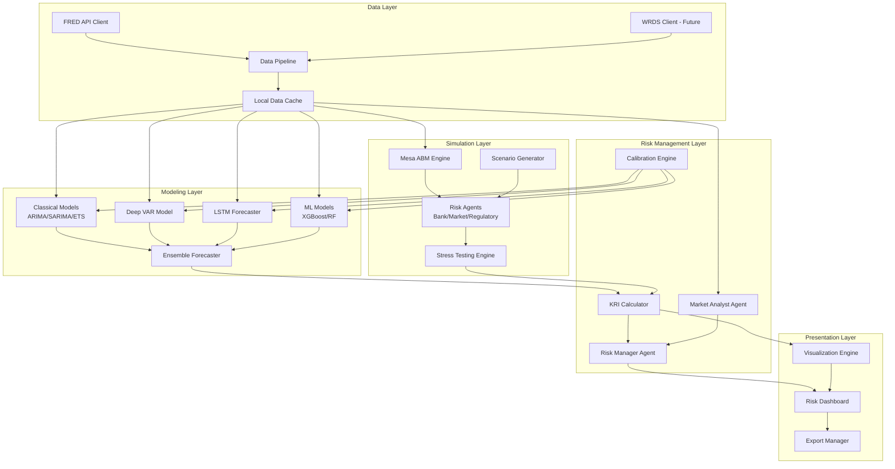
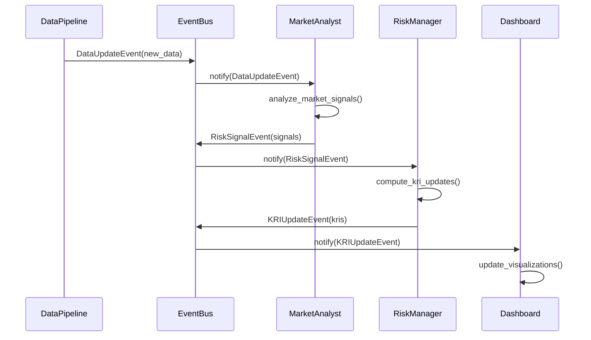

# Design Document

## Overview

The US Financial Risk Forecasting System is a locally-deployed risk management platform that combines real-time macroeconomic data, advanced time-series forecasting, and agent-based stress testing to predict key risk indicators (KRIs) for financial institutions. The system integrates FRED data, implements cutting-edge deep learning models (Deep VAR, LSTM), uses Mesa for agent-based simulation, and provides an intuitive dashboard for risk visualization.

**Core Capabilities:**
- Real-time FRED data integration with local caching
- Multi-model forecasting ensemble (ARIMA, Deep VAR, LSTM, XGBoost)
- Agent-based stress testing with Mesa framework
- Event-driven architecture with specialized risk agents
- Comprehensive KRI tracking across credit, market, liquidity, and operational risk
- Automated backtesting and model calibration
- Risk visualization dashboard with scenario analysis
- Modular design for future WRDS integration

**Design Principles:**
- Local-first: All processing and storage on local infrastructure
- Modular: Clean separation between data, models, simulation, and visualization
- Extensible: Easy to add new data sources, models, and KRIs
- Production-ready: Robust error handling, logging, and monitoring
- Research-oriented: Support for experimentation and model comparison

## Architecture

### High-Level System Architecture



### Event-Driven Architecture

The system follows an event-driven pattern where components communicate through typed events:



### Component Interaction Flow

1. **Data Acquisition**: FRED Client fetches data → Data Pipeline cleans/aligns → Cache stores locally
2. **Forecasting**: Models read from cache → Generate predictions → Ensemble combines forecasts
3. **Stress Testing**: Scenario Generator creates shocks → Mesa runs simulation → Agents interact
4. **Risk Assessment**: KRI Calculator computes metrics → Risk Manager evaluates thresholds → Alerts generated
5. **Visualization**: Dashboard reads KRIs → Visualization Engine renders charts → Export Manager saves outputs

## Components and Interfaces

### 1. Data Acquisition Components

#### FRED API Client
```python
class FREDClient:
    """
    Client for fetching US macroeconomic data from Federal Reserve Economic Data API.
    """
    def __init__(self, api_key: str, cache_dir: Path = Path("data/fred_cache")):
        self.api_key = api_key
        self.cache_dir = cache_dir
        self.base_url = "https://api.stlouisfed.org/fred"
        
    def fetch_series(
        self, 
        series_id: str, 
        start_date: str, 
        end_date: str,
        use_cache: bool = True
    ) -> pd.DataFrame:
        """
        Fetch time series data for a given FRED series ID.
        
        Args:
            series_id: FRED series identifier (e.g., 'UNRATE', 'FEDFUNDS')
            start_date: Start date in 'YYYY-MM-DD' format
            end_date: End date in 'YYYY-MM-DD' format
            use_cache: Whether to use cached data if available
            
        Returns:
            DataFrame with date index and series values
        """
        # Check cache first
        if use_cache:
            cached_data = self._load_from_cache(series_id, start_date, end_date)
            if cached_data is not None:
                return cached_data
        
        # Fetch from API
        params = {
            'series_id': series_id,
            'api_key': self.api_key,
            'file_type': 'json',
            'observation_start': start_date,
            'observation_end': end_date
        }
        
        response = requests.get(f"{self.base_url}/series/observations", params=params)
        response.raise_for_status()
        
        data = self._parse_response(response.json())
        
        # Cache the result
        self._save_to_cache(series_id, start_date, end_date, data)
        
        return data
    
    def fetch_multiple_series(
        self, 
        series_ids: List[str], 
        start_date: str, 
        end_date: str
    ) -> Dict[str, pd.DataFrame]:
        """Fetch multiple series concurrently."""
        with ThreadPoolExecutor(max_workers=5) as executor:
            futures = {
                executor.submit(self.fetch_series, sid, start_date, end_date): sid
                for sid in series_ids
            }
            
            results = {}
            for future in as_completed(futures):
                series_id = futures[future]
                try:
                    results[series_id] = future.result()
                except Exception as e:
                    logger.error(f"Failed to fetch {series_id}: {e}")
                    
            return results
```

#### Data Pipeline
```python
class DataPipeline:
    """
    ETL pipeline for cleaning, aligning, and versioning time-series data.
    """
    def __init__(self, fred_client: FREDClient):
        self.fred_client = fred_client
        self.transformers = []
        
    def add_transformer(self, transformer: DataTransformer):
        """Add a data transformation step to the pipeline."""
        self.transformers.append(transformer)
        
    def process(
        self, 
        series_config: Dict[str, SeriesConfig]
    ) -> pd.DataFrame:
        """
        Process multiple series through the pipeline.
        
        Args:
            series_config: Dictionary mapping series names to fetch configurations
            
        Returns:
            Aligned DataFrame with all series at consistent frequency
        """
        # Fetch all series
        raw_data = {}
        for name, config in series_config.items():
            raw_data[name] = self.fred_client.fetch_series(
                config.series_id,
                config.start_date,
                config.end_date
            )
        
        # Apply transformations
        processed_data = raw_data
        for transformer in self.transformers:
            processed_data = transformer.transform(processed_data)
        
        # Align to common frequency and date range
        aligned_data = self._align_series(processed_data)
        
        # Version the dataset
        self._save_versioned_dataset(aligned_data)
        
        return aligned_data
    
    def _align_series(
        self, 
        data: Dict[str, pd.DataFrame]
    ) -> pd.DataFrame:
        """Align multiple series to common frequency and date range."""
        # Find common date range
        # Resample to target frequency (monthly)
        # Handle missing values
        # Merge into single DataFrame
        pass
```

### 2. Forecasting Models

#### Deep VAR Model
```python
class DeepVARModel:
    """
    Deep learning-based Vector AutoRegression for multivariate forecasting.
    Captures non-linear interactions between economic variables.
    """
    def __init__(
        self, 
        n_variables: int,
        hidden_dims: List[int] = [64, 32],
        lag_order: int = 12,
        learning_rate: float = 0.001
    ):
        self.n_variables = n_variables
        self.hidden_dims = hidden_dims
        self.lag_order = lag_order
        self.learning_rate = learning_rate
        self.model = self._build_model()
        
    def _build_model(self) -> nn.Module:
        """Build neural network architecture for Deep VAR."""
        layers = []
        input_dim = self.n_variables * self.lag_order
        
        # Hidden layers
        prev_dim = input_dim
        for hidden_dim in self.hidden_dims:
            layers.append(nn.Linear(prev_dim, hidden_dim))
            layers.append(nn.ReLU())
            layers.append(nn.Dropout(0.2))
            prev_dim = hidden_dim
        
        # Output layer
        layers.append(nn.Linear(prev_dim, self.n_variables))
        
        return nn.Sequential(*layers)
    
    def fit(
        self, 
        X: np.ndarray, 
        y: np.ndarray,
        epochs: int = 100,
        batch_size: int = 32,
        validation_split: float = 0.2
    ):
        """
        Train the Deep VAR model.
        
        Args:
            X: Input features (lagged variables) shape (n_samples, n_variables * lag_order)
            y: Target values shape (n_samples, n_variables)
            epochs: Number of training epochs
            batch_size: Batch size for training
            validation_split: Fraction of data for validation
        """
        # Prepare data loaders
        # Training loop with validation
        # Early stopping based on validation loss
        pass
    
    def forecast(
        self, 
        history: np.ndarray, 
        horizon: int
    ) -> np.ndarray:
        """
        Generate multi-step forecasts.
        
        Args:
            history: Historical data (last lag_order observations)
            horizon: Number of steps to forecast
            
        Returns:
            Forecasted values shape (horizon, n_variables)
        """
        forecasts = []
        current_input = history[-self.lag_order:].flatten()
        
        for _ in range(horizon):
            # Predict next step
            with torch.no_grad():
                pred = self.model(torch.FloatTensor(current_input))
                forecasts.append(pred.numpy())
            
            # Update input for next prediction
            current_input = np.roll(current_input, -self.n_variables)
            current_input[-self.n_variables:] = pred.numpy()
        
        return np.array(forecasts)
```

#### LSTM Forecaster
```python
class LSTMForecaster:
    """
    LSTM-based time series forecaster for individual KRIs.
    """
    def __init__(
        self,
        input_dim: int = 1,
        hidden_dim: int = 64,
        num_layers: int = 2,
        lookback_window: int = 12,
        dropout: float = 0.2
    ):
        self.input_dim = input_dim
        self.hidden_dim = hidden_dim
        self.num_layers = num_layers
        self.lookback_window = lookback_window
        self.dropout = dropout
        self.model = self._build_model()
        
    def _build_model(self) -> nn.Module:
        """Build LSTM architecture."""
        return nn.LSTM(
            input_size=self.input_dim,
            hidden_size=self.hidden_dim,
            num_layers=self.num_layers,
            dropout=self.dropout,
            batch_first=True
        )
    
    def prepare_sequences(
        self, 
        data: np.ndarray
    ) -> Tuple[np.ndarray, np.ndarray]:
        """Create sliding window sequences for training."""
        X, y = [], []
        for i in range(len(data) - self.lookback_window):
            X.append(data[i:i+self.lookback_window])
            y.append(data[i+self.lookback_window])
        return np.array(X), np.array(y)
    
    def fit(
        self, 
        data: np.ndarray,
        epochs: int = 100,
        batch_size: int = 32
    ):
        """Train LSTM on time series data."""
        X, y = self.prepare_sequences(data)
        # Training implementation
        pass
    
    def forecast(
        self, 
        history: np.ndarray, 
        horizon: int
    ) -> np.ndarray:
        """Generate forecasts using trained LSTM."""
        # Recursive forecasting
        pass
```

#### Ensemble Forecaster
```python
class EnsembleForecaster:
    """
    Combines forecasts from multiple models using weighted averaging.
    """
    def __init__(self, models: List[BaseForecaster]):
        self.models = models
        self.weights = np.ones(len(models)) / len(models)
        
    def fit_weights(
        self, 
        validation_data: pd.DataFrame,
        metric: str = 'rmse'
    ):
        """
        Optimize ensemble weights based on validation performance.
        
        Args:
            validation_data: Historical data for weight optimization
            metric: Performance metric ('rmse', 'mae', 'mape')
        """
        # Generate forecasts from each model
        forecasts = []
        for model in self.models:
            pred = model.forecast(validation_data)
            forecasts.append(pred)
        
        # Optimize weights to minimize error
        def objective(weights):
            ensemble_pred = np.average(forecasts, axis=0, weights=weights)
            return self._compute_error(ensemble_pred, validation_data, metric)
        
        constraints = {'type': 'eq', 'fun': lambda w: np.sum(w) - 1}
        bounds = [(0, 1) for _ in range(len(self.models))]
        
        result = minimize(
            objective, 
            self.weights, 
            method='SLSQP',
            bounds=bounds,
            constraints=constraints
        )
        
        self.weights = result.x
        
    def forecast(
        self, 
        history: pd.DataFrame, 
        horizon: int
    ) -> pd.DataFrame:
        """Generate ensemble forecast."""
        forecasts = []
        for model in self.models:
            pred = model.forecast(history, horizon)
            forecasts.append(pred)
        
        ensemble_pred = np.average(forecasts, axis=0, weights=self.weights)
        return pd.DataFrame(ensemble_pred)
```

### 3. Agent-Based Stress Testing

#### Mesa Simulation Engine
```python
class RiskSimulationModel(mesa.Model):
    """
    Mesa-based agent-based model for stress testing and systemic risk analysis.
    """
    def __init__(
        self,
        n_banks: int = 10,
        n_firms: int = 50,
        scenario: EconomicScenario = None
    ):
        super().__init__()
        self.n_banks = n_banks
        self.n_firms = n_firms
        self.scenario = scenario or BaselineScenario()
        
        self.schedule = mesa.time.RandomActivation(self)
        self.datacollector = mesa.DataCollector(
            model_reporters={
                "system_liquidity": self.compute_system_liquidity,
                "default_rate": self.compute_default_rate,
                "network_stress": self.compute_network_stress
            },
            agent_reporters={
                "capital_ratio": "capital_ratio",
                "liquidity_ratio": "liquidity_ratio",
                "loan_portfolio_quality": "loan_quality"
            }
        )
        
        # Create agents
        self._create_banks()
        self._create_firms()
        self._create_network()
        
    def _create_banks(self):
        """Initialize bank agents with balance sheets."""
        for i in range(self.n_banks):
            bank = BankAgent(
                unique_id=i,
                model=self,
                initial_capital=np.random.uniform(100, 500),
                risk_appetite=np.random.uniform(0.3, 0.7)
            )
            self.schedule.add(bank)
    
    def step(self):
        """Execute one simulation step."""
        # Apply scenario shocks
        self.scenario.apply_shock(self, self.schedule.steps)
        
        # Agents make decisions
        self.schedule.step()
        
        # Collect data
        self.datacollector.collect(self)
        
    def run_simulation(self, n_steps: int = 100) -> pd.DataFrame:
        """Run full simulation and return results."""
        for _ in range(n_steps):
            self.step()
        
        return self.datacollector.get_model_vars_dataframe()
```

#### Bank Agent
```python
class BankAgent(mesa.Agent):
    """
    Bank agent with balance sheet, lending decisions, and risk management.
    """
    def __init__(
        self,
        unique_id: int,
        model: mesa.Model,
        initial_capital: float,
        risk_appetite: float
    ):
        super().__init__(unique_id, model)
        self.capital = initial_capital
        self.deposits = initial_capital * 5
        self.loans = initial_capital * 4
        self.reserves = initial_capital
        self.risk_appetite = risk_appetite
        
    @property
    def capital_ratio(self) -> float:
        """Compute capital adequacy ratio."""
        return self.capital / self.loans if self.loans > 0 else 1.0
    
    @property
    def liquidity_ratio(self) -> float:
        """Compute liquidity coverage ratio."""
        return self.reserves / self.deposits if self.deposits > 0 else 1.0
    
    def step(self):
        """Execute bank's decision-making for this period."""
        # Assess loan portfolio
        self._assess_loan_quality()
        
        # Make lending decisions
        self._make_lending_decisions()
        
        # Manage liquidity
        self._manage_liquidity()
        
        # Update capital
        self._update_capital()
    
    def _assess_loan_quality(self):
        """Evaluate loan portfolio and recognize losses."""
        # Determine default rate based on economic conditions
        unemployment = self.model.scenario.get_unemployment_rate(self.model.schedule.steps)
        base_default_rate = 0.02
        stress_multiplier = 1 + (unemployment - 0.04) * 10
        
        default_rate = base_default_rate * stress_multiplier
        loan_losses = self.loans * default_rate
        
        self.capital -= loan_losses
        self.loans -= loan_losses
```


    
    def _make_lending_decisions(self):
        """Decide on new loan origination."""
        # Adjust lending based on capital ratio and risk appetite
        if self.capital_ratio > 0.08:  # Above regulatory minimum
            new_loans = self.capital * self.risk_appetite * 0.1
            self.loans += new_loans
            self.reserves -= new_loans
```

#### Scenario Generator
```python
class EconomicScenario:
    """Base class for economic shock scenarios."""
    def __init__(self, name: str):
        self.name = name
        
    def apply_shock(self, model: mesa.Model, step: int):
        """Apply economic shock at given simulation step."""
        raise NotImplementedError

class RecessionScenario(EconomicScenario):
    """Recession scenario with unemployment spike and GDP contraction."""
    def __init__(self):
        super().__init__("Recession")
        self.shock_start = 12  # Start after 12 months
        self.shock_duration = 18  # Last 18 months
        
    def apply_shock(self, model: mesa.Model, step: int):
        if self.shock_start <= step < self.shock_start + self.shock_duration:
            # Increase unemployment
            shock_intensity = (step - self.shock_start) / self.shock_duration
            model.unemployment_rate = 0.04 + 0.06 * shock_intensity
            
            # Decrease GDP growth
            model.gdp_growth = 0.02 - 0.05 * shock_intensity
            
            # Widen credit spreads
            model.credit_spread = 0.02 + 0.04 * shock_intensity

class InterestRateShockScenario(EconomicScenario):
    """Sudden interest rate spike scenario."""
    def __init__(self, rate_increase: float = 0.03):
        super().__init__("Interest Rate Shock")
        self.rate_increase = rate_increase
        self.shock_step = 6
        
    def apply_shock(self, model: mesa.Model, step: int):
        if step == self.shock_step:
            model.interest_rate += self.rate_increase
```

### 4. Risk Management Components

#### KRI Calculator
```python
class KRICalculator:
    """
    Computes Key Risk Indicators from forecasts and simulation results.
    """
    def __init__(self, config: KRIConfig):
        self.config = config
        self.kri_definitions = self._load_kri_definitions()
        
    def compute_credit_kris(
        self, 
        forecasts: pd.DataFrame,
        simulation_results: pd.DataFrame
    ) -> Dict[str, float]:
        """Compute credit risk KRIs."""
        kris = {}
        
        # Loan default rate
        kris['loan_default_rate'] = simulation_results['default_rate'].mean()
        
        # Delinquency rate (leading indicator)
        unemployment_forecast = forecasts['unemployment'].iloc[-1]
        kris['delinquency_rate'] = self._estimate_delinquency(unemployment_forecast)
        
        # Credit quality score
        kris['credit_quality_score'] = self._compute_credit_quality(
            forecasts, simulation_results
        )
        
        # Loan concentration ratio
        kris['loan_concentration'] = simulation_results['loan_concentration'].mean()
        
        return kris
    
    def compute_market_kris(
        self, 
        forecasts: pd.DataFrame,
        portfolio_data: pd.DataFrame
    ) -> Dict[str, float]:
        """Compute market risk KRIs."""
        kris = {}
        
        # Portfolio volatility
        returns = portfolio_data['returns']
        kris['portfolio_volatility'] = returns.std() * np.sqrt(252)
        
        # Value at Risk (95% confidence)
        kris['var_95'] = np.percentile(returns, 5) * portfolio_data['value'].iloc[-1]
        
        # Interest rate risk (duration-based)
        kris['interest_rate_risk'] = self._compute_duration_risk(
            portfolio_data, forecasts['interest_rate']
        )
        
        return kris
    
    def compute_liquidity_kris(
        self, 
        balance_sheet: pd.DataFrame
    ) -> Dict[str, float]:
        """Compute liquidity risk KRIs."""
        kris = {}
        
        # Liquidity coverage ratio
        liquid_assets = balance_sheet['cash'] + balance_sheet['marketable_securities']
        net_outflows = balance_sheet['deposits'] * 0.1  # Assume 10% runoff
        kris['liquidity_coverage_ratio'] = liquid_assets / net_outflows
        
        # Deposit flow ratio
        kris['deposit_flow_ratio'] = balance_sheet['deposit_change'] / balance_sheet['deposits']
        
        return kris
    
    def evaluate_thresholds(
        self, 
        kris: Dict[str, float]
    ) -> Dict[str, str]:
        """Evaluate KRIs against risk thresholds."""
        alerts = {}
        
        for kri_name, kri_value in kris.items():
            thresholds = self.kri_definitions[kri_name]['thresholds']
            
            if kri_value > thresholds['critical']:
                alerts[kri_name] = 'CRITICAL'
            elif kri_value > thresholds['high']:
                alerts[kri_name] = 'HIGH'
            elif kri_value > thresholds['medium']:
                alerts[kri_name] = 'MEDIUM'
            else:
                alerts[kri_name] = 'LOW'
        
        return alerts
```

#### Risk Manager Agent
```python
class RiskManagerAgent:
    """
    Event-driven agent that monitors risk signals and computes assessments.
    """
    def __init__(
        self,
        kri_calculator: KRICalculator,
        event_bus: EventBus
    ):
        self.kri_calculator = kri_calculator
        self.event_bus = event_bus
        self.current_kris = {}
        
        # Subscribe to relevant events
        self.event_bus.subscribe('DataUpdateEvent', self.on_data_update)
        self.event_bus.subscribe('ForecastCompleteEvent', self.on_forecast_complete)
        self.event_bus.subscribe('SimulationCompleteEvent', self.on_simulation_complete)
        
    def on_data_update(self, event: DataUpdateEvent):
        """Handle new data availability."""
        logger.info(f"Risk Manager received data update: {event.series_ids}")
        
        # Trigger risk recalculation if needed
        if self._should_recalculate(event):
            self.event_bus.publish(RecalculateRiskEvent())
    
    def on_forecast_complete(self, event: ForecastCompleteEvent):
        """Handle new forecast availability."""
        logger.info(f"Risk Manager received forecast for horizon {event.horizon}")
        
        # Compute KRIs from forecasts
        kris = self.kri_calculator.compute_all_kris(
            forecasts=event.forecasts,
            simulation_results=self.latest_simulation_results
        )
        
        # Evaluate thresholds
        alerts = self.kri_calculator.evaluate_thresholds(kris)
        
        # Publish KRI update
        self.event_bus.publish(KRIUpdateEvent(kris=kris, alerts=alerts))
        
    def on_simulation_complete(self, event: SimulationCompleteEvent):
        """Handle simulation completion."""
        self.latest_simulation_results = event.results
        
        # Recompute KRIs with new simulation data
        self.on_forecast_complete(self.latest_forecast_event)
```

#### Market Analyst Agent
```python
class MarketAnalystAgent:
    """
    Analyzes market data and identifies risk signals.
    """
    def __init__(self, event_bus: EventBus):
        self.event_bus = event_bus
        self.event_bus.subscribe('DataUpdateEvent', self.on_data_update)
        
    def on_data_update(self, event: DataUpdateEvent):
        """Analyze new market data for risk signals."""
        signals = []
        
        # Check for volatility spikes
        if self._detect_volatility_spike(event.data):
            signals.append(RiskSignal(
                type='volatility_spike',
                severity='high',
                description='Market volatility exceeded 2 standard deviations'
            ))
        
        # Check for credit spread widening
        if self._detect_spread_widening(event.data):
            signals.append(RiskSignal(
                type='credit_spread_widening',
                severity='medium',
                description='Credit spreads widened by 50bps in past month'
            ))
        
        # Publish signals
        if signals:
            self.event_bus.publish(RiskSignalEvent(signals=signals))
    
    def _detect_volatility_spike(self, data: pd.DataFrame) -> bool:
        """Detect abnormal volatility increases."""
        recent_vol = data['returns'].tail(20).std()
        historical_vol = data['returns'].std()
        return recent_vol > historical_vol * 2
```

### 5. Calibration and Backtesting

#### Calibration Engine
```python
class CalibrationEngine:
    """
    Handles model training, hyperparameter tuning, and performance evaluation.
    """
    def __init__(self, models: List[BaseForecaster]):
        self.models = models
        self.performance_history = []
        
    def backtest(
        self,
        data: pd.DataFrame,
        train_size: float = 0.7,
        cv_folds: int = 5,
        horizon: int = 12
    ) -> Dict[str, pd.DataFrame]:
        """
        Perform time-series cross-validation backtesting.
        
        Args:
            data: Historical data for backtesting
            train_size: Initial training set size as fraction
            cv_folds: Number of cross-validation folds
            horizon: Forecast horizon in periods
            
        Returns:
            Dictionary of performance metrics per model
        """
        results = {}
        
        for model in self.models:
            model_results = []
            
            # Time series cross-validation
            tscv = TimeSeriesSplit(n_splits=cv_folds)
            
            for train_idx, test_idx in tscv.split(data):
                train_data = data.iloc[train_idx]
                test_data = data.iloc[test_idx]
                
                # Train model
                model.fit(train_data)
                
                # Generate forecasts
                forecasts = model.forecast(train_data, horizon=len(test_idx))
                
                # Compute metrics
                metrics = self._compute_metrics(forecasts, test_data)
                model_results.append(metrics)
            
            results[model.name] = pd.DataFrame(model_results)
        
        return results
    
    def _compute_metrics(
        self,
        forecasts: np.ndarray,
        actuals: pd.DataFrame
    ) -> Dict[str, float]:
        """Compute forecast accuracy metrics."""
        mae = np.mean(np.abs(forecasts - actuals.values))
        rmse = np.sqrt(np.mean((forecasts - actuals.values) ** 2))
        mape = np.mean(np.abs((forecasts - actuals.values) / actuals.values)) * 100
        
        # Directional accuracy
        forecast_direction = np.sign(np.diff(forecasts, axis=0))
        actual_direction = np.sign(np.diff(actuals.values, axis=0))
        directional_accuracy = np.mean(forecast_direction == actual_direction)
        
        return {
            'mae': mae,
            'rmse': rmse,
            'mape': mape,
            'directional_accuracy': directional_accuracy
        }
    
    def optimize_hyperparameters(
        self,
        model: BaseForecaster,
        data: pd.DataFrame,
        param_grid: Dict[str, List]
    ) -> Dict[str, Any]:
        """
        Optimize model hyperparameters using grid search.
        
        Args:
            model: Model to optimize
            data: Training data
            param_grid: Dictionary of parameter names to lists of values
            
        Returns:
            Best hyperparameters
        """
        best_score = float('inf')
        best_params = None
        
        # Generate all parameter combinations
        param_combinations = list(itertools.product(*param_grid.values()))
        
        for params in param_combinations:
            param_dict = dict(zip(param_grid.keys(), params))
            
            # Create model with these parameters
            model_instance = model.__class__(**param_dict)
            
            # Evaluate with cross-validation
            cv_results = self.backtest(data, cv_folds=3)
            avg_rmse = cv_results[model.name]['rmse'].mean()
            
            if avg_rmse < best_score:
                best_score = avg_rmse
                best_params = param_dict
        
        return best_params
    
    def auto_retrain(
        self,
        trigger_condition: str = 'weekly',
        performance_threshold: float = 0.1
    ):
        """
        Automatically retrain models when conditions are met.
        
        Args:
            trigger_condition: When to retrain ('daily', 'weekly', 'monthly', 'performance')
            performance_threshold: Retrain if performance degrades by this fraction
        """
        # Implementation for automated retraining
        pass
```

### 6. Visualization and Dashboard

#### Risk Dashboard
```python
class RiskDashboard:
    """
    Web-based dashboard for risk visualization and monitoring.
    """
    def __init__(self, port: int = 8050):
        self.app = dash.Dash(__name__)
        self.port = port
        self.setup_layout()
        self.setup_callbacks()
        
    def setup_layout(self):
        """Define dashboard layout."""
        self.app.layout = html.Div([
            html.H1("US Financial Risk Forecasting Dashboard"),
            
            # KRI Summary Cards
            html.Div([
                self._create_kri_card("Credit Risk", "loan_default_rate"),
                self._create_kri_card("Market Risk", "portfolio_var"),
                self._create_kri_card("Liquidity Risk", "lcr"),
            ], className="kri-cards"),
            
            # Time Series Charts
            dcc.Graph(id='kri-timeseries'),
            dcc.Graph(id='forecast-comparison'),
            
            # Scenario Analysis
            html.Div([
                html.H3("Scenario Analysis"),
                dcc.Dropdown(
                    id='scenario-selector',
                    options=[
                        {'label': 'Baseline', 'value': 'baseline'},
                        {'label': 'Recession', 'value': 'recession'},
                        {'label': 'Interest Rate Shock', 'value': 'rate_shock'}
                    ],
                    value='baseline'
                ),
                dcc.Graph(id='scenario-chart')
            ]),
            
            # Model Performance
            dcc.Graph(id='model-performance'),
            
            # Export Controls
            html.Button("Export Results", id='export-button'),
            
            # Auto-refresh
            dcc.Interval(id='interval-component', interval=60*1000, n_intervals=0)
        ])
    
    def setup_callbacks(self):
        """Define interactive callbacks."""
        @self.app.callback(
            Output('kri-timeseries', 'figure'),
            Input('interval-component', 'n_intervals')
        )
        def update_kri_chart(n):
            # Fetch latest KRI data
            kri_data = self.fetch_latest_kris()
            
            # Create figure
            fig = go.Figure()
            for kri_name, values in kri_data.items():
                fig.add_trace(go.Scatter(
                    x=values.index,
                    y=values.values,
                    name=kri_name,
                    mode='lines+markers'
                ))
            
            fig.update_layout(
                title="Key Risk Indicators Over Time",
                xaxis_title="Date",
                yaxis_title="Value"
            )
            
            return fig
    
    def run(self):
        """Start dashboard server."""
        self.app.run_server(debug=False, port=self.port)
```

## Data Models

### Core Data Structures

```python
from dataclasses import dataclass
from typing import List, Dict, Optional
from datetime import datetime
from enum import Enum

@dataclass
class SeriesConfig:
    """Configuration for fetching a time series."""
    series_id: str
    name: str
    start_date: str
    end_date: str
    frequency: str  # 'daily', 'monthly', 'quarterly'
    transformation: Optional[str] = None  # 'log', 'diff', 'pct_change'

@dataclass
class KRIDefinition:
    """Definition of a Key Risk Indicator."""
    name: str
    category: str  # 'credit', 'market', 'liquidity', 'operational'
    description: str
    calculation_method: str
    data_sources: List[str]
    thresholds: Dict[str, float]  # {'low': 0.02, 'medium': 0.05, 'high': 0.10, 'critical': 0.15}
    is_leading: bool  # True for leading indicators, False for lagging

@dataclass
class ForecastResult:
    """Result from a forecasting model."""
    model_name: str
    kri_name: str
    forecast_date: datetime
    horizon: int
    point_forecast: np.ndarray
    lower_bound: np.ndarray
    upper_bound: np.ndarray
    confidence_level: float = 0.95

@dataclass
class RiskSignal:
    """Risk signal identified by Market Analyst."""
    type: str
    severity: str  # 'low', 'medium', 'high', 'critical'
    description: str
    timestamp: datetime
    affected_kris: List[str]

class RiskLevel(Enum):
    """Risk level enumeration."""
    LOW = "low"
    MEDIUM = "medium"
    HIGH = "high"
    CRITICAL = "critical"

@dataclass
class KRIAssessment:
    """Complete KRI assessment with alerts."""
    kri_name: str
    current_value: float
    forecast_value: float
    risk_level: RiskLevel
    threshold_breached: Optional[str]
    trend: str  # 'improving', 'stable', 'deteriorating'
    timestamp: datetime
```

### Event Schemas

```python
@dataclass
class DataUpdateEvent:
    """Event published when new data is available."""
    series_ids: List[str]
    data: pd.DataFrame
    timestamp: datetime

@dataclass
class ForecastCompleteEvent:
    """Event published when forecasting completes."""
    forecasts: Dict[str, ForecastResult]
    horizon: int
    timestamp: datetime

@dataclass
class SimulationCompleteEvent:
    """Event published when stress test simulation completes."""
    scenario_name: str
    results: pd.DataFrame
    summary_stats: Dict[str, float]
    timestamp: datetime

@dataclass
class KRIUpdateEvent:
    """Event published when KRIs are updated."""
    kris: Dict[str, float]
    alerts: Dict[str, str]
    timestamp: datetime

@dataclass
class RiskSignalEvent:
    """Event published when risk signals are detected."""
    signals: List[RiskSignal]
    timestamp: datetime
```

## Error Handling

### Error Handling Strategy

1. **Data Acquisition Errors**
   - FRED API failures: Use cached data with staleness warnings
   - Network timeouts: Retry with exponential backoff (3 attempts)
   - Invalid API key: Fail fast with clear error message
   - Missing data: Interpolate or forward-fill with logging

2. **Model Errors**
   - Training failures: Fall back to simpler models
   - Convergence issues: Adjust hyperparameters automatically
   - Prediction errors: Return NaN with error flag
   - Memory errors: Reduce batch size or use streaming

3. **Simulation Errors**
   - Agent failures: Isolate and continue with remaining agents
   - Numerical instability: Apply bounds and constraints
   - Timeout: Save partial results and resume

4. **System Errors**
   - Disk space: Clean old cache files automatically
   - Memory pressure: Implement data streaming
   - Process crashes: Auto-restart with state recovery

### Error Handling Implementation

```python
class ErrorHandler:
    """Centralized error handling for the risk forecasting system."""
    
    @staticmethod
    def handle_data_error(error: Exception, series_id: str) -> Optional[pd.DataFrame]:
        """Handle data acquisition errors."""
        if isinstance(error, requests.HTTPError):
            if error.response.status_code == 429:  # Rate limit
                logger.warning(f"Rate limit hit for {series_id}, using cache")
                return CacheManager.get_cached_series(series_id)
            elif error.response.status_code == 401:  # Auth error
                raise ValueError("Invalid FRED API key")
        
        # Try cache fallback
        cached_data = CacheManager.get_cached_series(series_id)
        if cached_data is not None:
            logger.info(f"Using cached data for {series_id}")
            return cached_data
        
        logger.error(f"Failed to fetch {series_id}: {error}")
        return None
    
    @staticmethod
    def handle_model_error(error: Exception, model_name: str) -> ForecastResult:
        """Handle model training/prediction errors."""
        logger.error(f"Model {model_name} failed: {error}")
        
        # Return empty forecast with error flag
        return ForecastResult(
            model_name=model_name,
            kri_name="",
            forecast_date=datetime.now(),
            horizon=0,
            point_forecast=np.array([np.nan]),
            lower_bound=np.array([np.nan]),
            upper_bound=np.array([np.nan]),
            error=str(error)
        )
```

## Testing Strategy

### Unit Testing

```python
class TestFREDClient:
    """Unit tests for FRED API client."""
    
    def test_fetch_series_success(self, mock_requests):
        """Test successful series fetch."""
        mock_requests.get.return_value.json.return_value = {
            'observations': [
                {'date': '2023-01-01', 'value': '3.5'},
                {'date': '2023-02-01', 'value': '3.6'}
            ]
        }
        
        client = FREDClient(api_key='test_key')
        data = client.fetch_series('UNRATE', '2023-01-01', '2023-02-01')
        
        assert len(data) == 2
        assert data.iloc[0]['value'] == 3.5
    
    def test_fetch_series_with_cache(self, tmp_path):
        """Test cache functionality."""
        client = FREDClient(api_key='test_key', cache_dir=tmp_path)
        
        # First fetch (from API)
        data1 = client.fetch_series('UNRATE', '2023-01-01', '2023-02-01')
        
        # Second fetch (from cache)
        data2 = client.fetch_series('UNRATE', '2023-01-01', '2023-02-01', use_cache=True)
        
        pd.testing.assert_frame_equal(data1, data2)

class TestDeepVARModel:
    """Unit tests for Deep VAR model."""
    
    def test_model_initialization(self):
        """Test model creation."""
        model = DeepVARModel(n_variables=3, hidden_dims=[32, 16], lag_order=6)
        assert model.n_variables == 3
        assert model.lag_order == 6
    
    def test_forecast_shape(self):
        """Test forecast output shape."""
        model = DeepVARModel(n_variables=3, lag_order=6)
        history = np.random.randn(12, 3)
        
        forecasts = model.forecast(history, horizon=6)
        
        assert forecasts.shape == (6, 3)
```

### Integration Testing

```python
class TestEndToEndPipeline:
    """Integration tests for complete pipeline."""
    
    @pytest.mark.integration
    def test_full_forecast_pipeline(self):
        """Test data fetch -> model training -> forecasting."""
        # Setup
        fred_client = FREDClient(api_key=os.getenv('FRED_API_KEY'))
        pipeline = DataPipeline(fred_client)
        model = DeepVARModel(n_variables=3)
        
        # Fetch data
        series_config = {
            'unemployment': SeriesConfig('UNRATE', 'unemployment', '2020-01-01', '2023-12-31', 'monthly'),
            'inflation': SeriesConfig('CPIAUCSL', 'inflation', '2020-01-01', '2023-12-31', 'monthly'),
            'interest_rate': SeriesConfig('FEDFUNDS', 'interest_rate', '2020-01-01', '2023-12-31', 'monthly')
        }
        
        data = pipeline.process(series_config)
        
        # Train model
        X, y = prepare_var_data(data, lag_order=12)
        model.fit(X, y)
        
        # Generate forecast
        forecasts = model.forecast(data.values[-12:], horizon=6)
        
        # Assertions
        assert forecasts.shape == (6, 3)
        assert not np.isnan(forecasts).any()
    
    @pytest.mark.integration
    def test_stress_testing_pipeline(self):
        """Test simulation -> KRI calculation -> risk assessment."""
        # Run simulation
        scenario = RecessionScenario()
        model = RiskSimulationModel(n_banks=5, n_firms=20, scenario=scenario)
        results = model.run_simulation(n_steps=50)
        
        # Calculate KRIs
        kri_calc = KRICalculator(config=KRIConfig())
        kris = kri_calc.compute_credit_kris(forecasts=None, simulation_results=results)
        
        # Evaluate thresholds
        alerts = kri_calc.evaluate_thresholds(kris)
        
        # Assertions
        assert 'loan_default_rate' in kris
        assert 'loan_default_rate' in alerts
```

### Performance Testing

```python
class TestPerformance:
    """Performance and scalability tests."""
    
    def test_forecast_latency(self):
        """Test forecast generation time."""
        model = DeepVARModel(n_variables=10)
        history = np.random.randn(100, 10)
        
        start_time = time.time()
        forecasts = model.forecast(history, horizon=12)
        elapsed = time.time() - start_time
        
        assert elapsed < 1.0  # Should complete in under 1 second
    
    def test_simulation_scalability(self):
        """Test simulation with varying agent counts."""
        for n_agents in [10, 50, 100]:
            model = RiskSimulationModel(n_banks=n_agents, n_firms=n_agents*5)
            
            start_time = time.time()
            model.run_simulation(n_steps=100)
            elapsed = time.time() - start_time
            
            # Should scale roughly linearly
            assert elapsed < n_agents * 0.1
```

## Deployment and Operations

### Local Setup

```bash
# 1. Clone repository
git clone <repo_url>
cd us-financial-risk-forecasting

# 2. Create virtual environment
python -m venv venv
source venv/bin/activate  # On Windows: venv\Scripts\activate

# 3. Install dependencies
pip install -r requirements.txt

# 4. Configure environment
cp .env.example .env
# Edit .env and add FRED_API_KEY

# 5. Initialize data cache
python scripts/init_data_cache.py

# 6. Run tests
pytest tests/

# 7. Start dashboard
python src/dashboard/app.py
```

### Configuration Management

```python
# config.py
from pydantic import BaseSettings

class Settings(BaseSettings):
    # API Keys
    fred_api_key: str
    wrds_username: Optional[str] = None
    wrds_password: Optional[str] = None
    
    # Data Settings
    data_cache_dir: Path = Path("data/cache")
    data_start_date: str = "2015-01-01"
    data_frequency: str = "monthly"
    
    # Model Settings
    forecast_horizon: int = 12
    ensemble_weights_method: str = "performance"
    retrain_frequency: str = "weekly"
    
    # Simulation Settings
    n_banks: int = 10
    n_firms: int = 50
    simulation_steps: int = 100
    
    # Dashboard Settings
    dashboard_port: int = 8050
    auto_refresh_interval: int = 60
    
    class Config:
        env_file = ".env"

settings = Settings()
```

### Monitoring and Logging

```python
import logging
from logging.handlers import RotatingFileHandler

def setup_logging():
    """Configure logging for the application."""
    logger = logging.getLogger('risk_forecasting')
    logger.setLevel(logging.INFO)
    
    # Console handler
    console_handler = logging.StreamHandler()
    console_handler.setLevel(logging.INFO)
    console_formatter = logging.Formatter(
        '%(asctime)s - %(name)s - %(levelname)s - %(message)s'
    )
    console_handler.setFormatter(console_formatter)
    
    # File handler with rotation
    file_handler = RotatingFileHandler(
        'logs/risk_forecasting.log',
        maxBytes=10*1024*1024,  # 10MB
        backupCount=5
    )
    file_handler.setLevel(logging.DEBUG)
    file_handler.setFormatter(console_formatter)
    
    logger.addHandler(console_handler)
    logger.addHandler(file_handler)
    
    return logger
```

## Future Enhancements

### WRDS Integration

When WRDS access is granted, implement:

1. **CRSP Data Integration**
   - Daily stock prices and returns
   - Market capitalization and trading volume
   - Corporate actions and delisting information

2. **Compustat Integration**
   - Quarterly financial statements
   - Balance sheet ratios
   - Credit ratings and bond data

3. **Enhanced KRIs**
   - Firm-level credit risk scores
   - Market microstructure indicators
   - Systemic risk measures (CoVaR, MES)

### Advanced Features

1. **Real-time Streaming**
   - WebSocket connections for live data
   - Streaming model updates
   - Real-time alert notifications

2. **Machine Learning Enhancements**
   - Transformer models for time series
   - Reinforcement learning for portfolio optimization
   - Explainable AI for model interpretability

3. **Expanded Risk Coverage**
   - Climate risk indicators
   - Cyber risk metrics
   - Geopolitical risk factors

4. **Collaboration Features**
   - Multi-user access with role-based permissions
   - Shared scenario libraries
   - Collaborative annotations and notes
